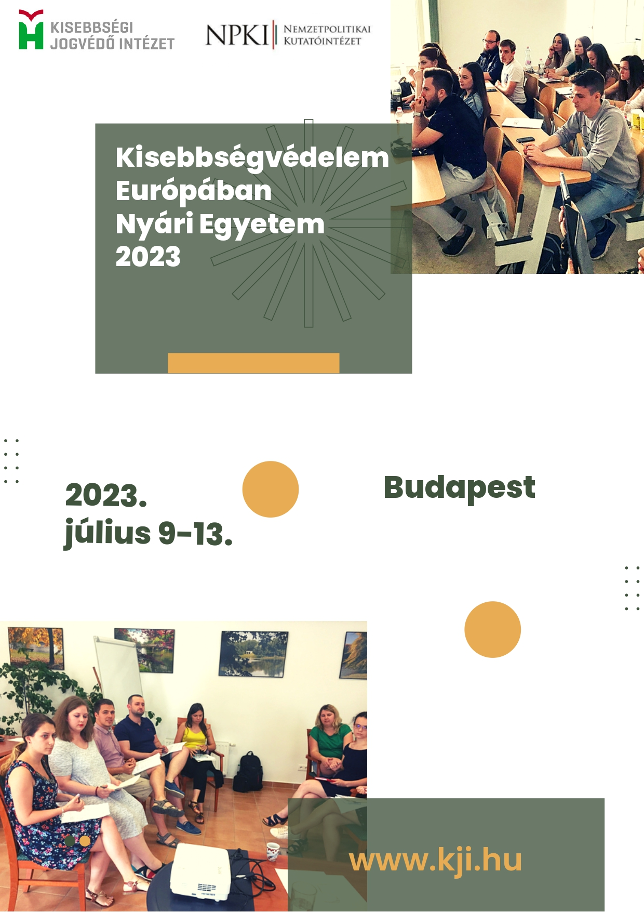

☀️A Kisebbségi Jogvédő Intézet és a Nemzetpolitikai Kutatóintézet 2023-ban immár tizenegyedik alkalommal rendezi meg a Kisebbségvédelem Európában című nyári egyetemet. A program célja, hogy felkutassa azokat a hallgatókat, doktoranduszokat, pályakezdőket, akiket érdekel a külhoni magyarság jog- és érdekvédelme. ⚖️
📅Jelentkezési határidő: 2023. május 15.
<a href="<https://l.facebook.com/l.php?u=https%3A%2F%2Fbgazrt.hu%2Fkisebbsegvedelem-europaban-nyari-egyetem-2023%2F%3Ffbclid%3DIwAR0wLutwUddy6VhJTv2X_JQK1wld-eNnIImfEnmAoIjkx79un-xPBGJXysc&h=AT1NCRaw3dm8bAlgc37Ejln_7pbEbtwQOnEOuBoOXw4DxEZ04X5XbfU8vFoy4uEESR5iclRa-X4M1XOjgYPAI2R-fuHOLglvSCMqfpgt9Gsd_e_cXHDreJ58v8uOhOr1nXRu&__tn__=-UK-R&c[0>]=AT2I2to2JTkuPZNUczGp6saxKhiIpHTNzgB5wtfJrnINxCSai1igakvH3or5XjrSgD491yds4J_Q8bnZ3EjB6TOrHfWnyXeRoCqI0KP_61BJidonahjHdpRMV4ObreyzTx0Ts1f872uC0rWDzGno5Ljp-5lI67yAv9A3-CmwbB4wBS66_w">További részletek és tudnivalók</a>

